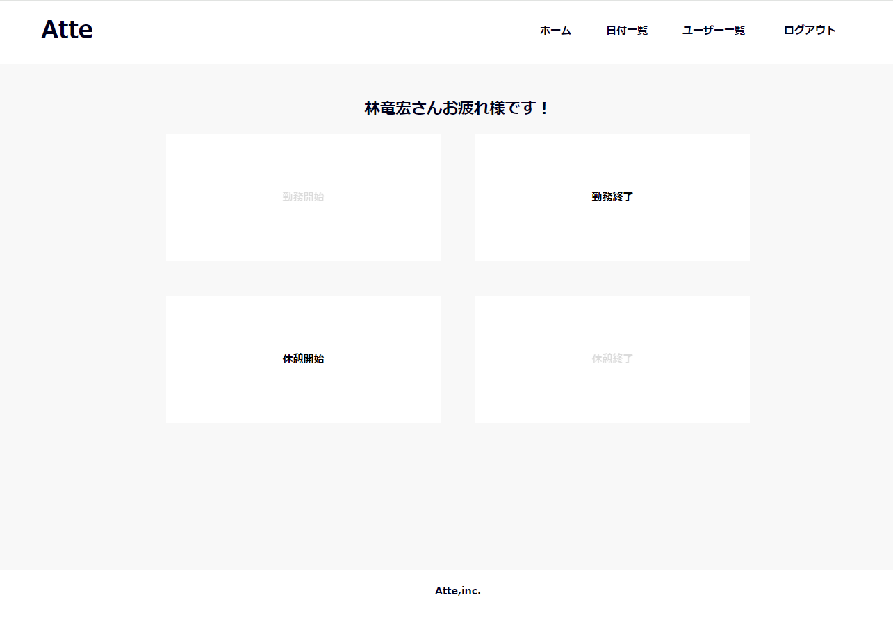
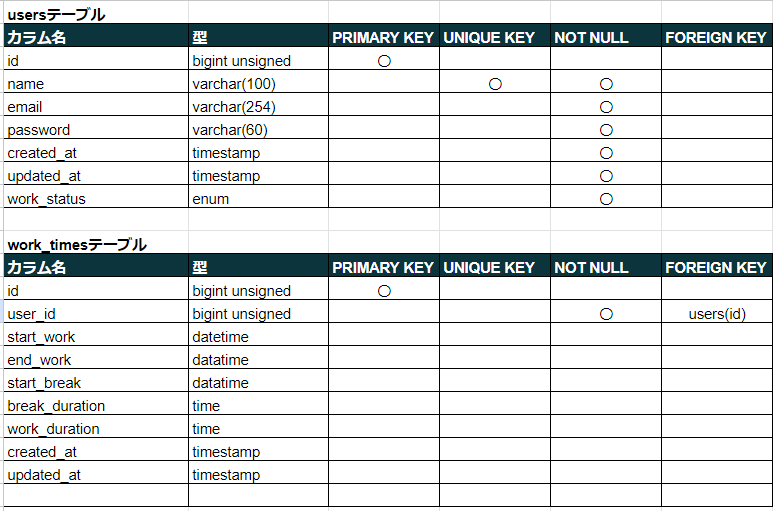
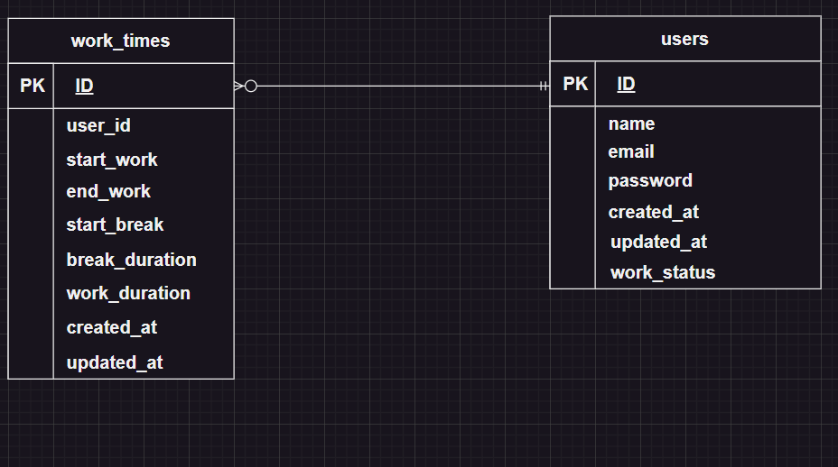

# アプリケーション名

勤怠管理システム（Atte（アット）） 

概要説明（どんなアプリか） 
*勤怠管理システムであり、打刻ページで勤務の開始終了時刻や勤務時間、休憩時間を管理し、日付別やユーザーごとに勤怠の状況を確認できるアプリ 

*

## 作成した目的

概要説明（なんで作成したか） 
*とある企業から人事評価のために勤怠管理システムを作成して欲しいと依頼があったため。 

## アプリケーションURL

*http://ec2-54-65-234-135.ap-northeast-1.compute.amazonaws.com/ 

*新規にユーザー登録し、ログインする時はメール認証が必要になるため、以下URLにアクセスし、メール認証を行ってください。上手くいかない場合は、一番下のテストユーザーを使用してください。 
*http://ec2-54-65-234-135.ap-northeast-1.compute.amazonaws.com:8025/ 

上記URLにアクセスしても表示されない場合、私にお申し付けください。 

## 機能一覧

*・会員登録機能 
*・ログイン機能 
*・ログアウト機能 
*・メールでの本人確認機能 
*・勤務開始機能 
*・勤務終了機能 
*・休憩開始機能 
*・休憩終了機能 
*・日付別勤怠情報取得機能 
*・ユーザー一覧情報取得機能 
*・ユーザーごとの勤怠情報取得機能 
*・ページネーション機能 

## 使用技術（実行環境）

*・PHP 7.4.9 
*・Laravel 8 
*・MySQL 8.0.26 

## テーブル設計

*

## ER図

*

# 環境構築

*Dockerビルド 
*1.git clone リンク 
*2.DockerDesktopアプリを立ち上げる 
*3.docker-compose up -d --build 

*MySQLは、OSによって起動しない場合があるのでそれぞれのPCに合わせてdocker-compose.ymlファイルを編集してください。

*Laravel環境構築

*1.docker-compose exec php bash 
*2.composer install 
*3.env.exampleファイルから.envを作成し、環境変数を変更 
*4.php artisan key:generate 
*5.php artisan migrate 
*+α.php artisan db:seed（※ダミーデータを入れたい場合はこのコマンドを打ってください。） 

## URL

*開発環境:http://localhost/ 
*phpMyAdmin:http://localhost:8080/ 
*MailHog:http://localhost:8025/ 

## アカウントの種類（テストユーザー）

*メールアドレス：test@example1.com 
*パスワード：testtesttest 

*ローカル環境ではダミーデータを入れないとこのアカウントは使えません。 